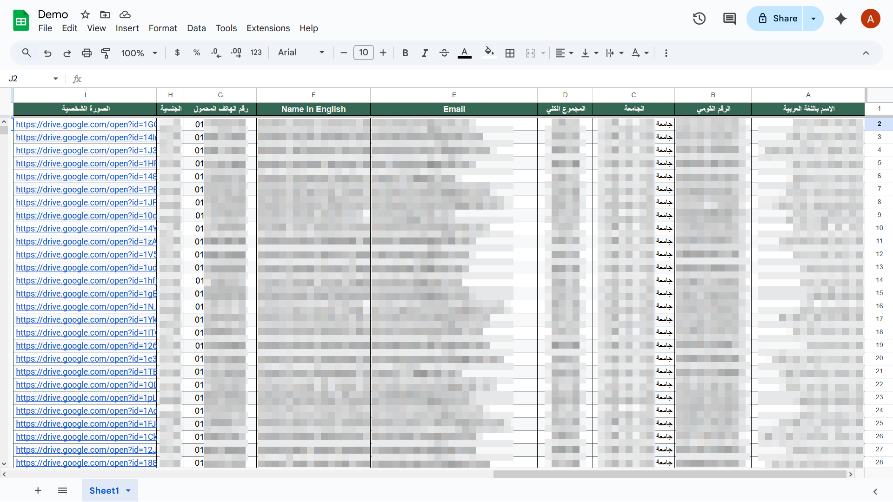
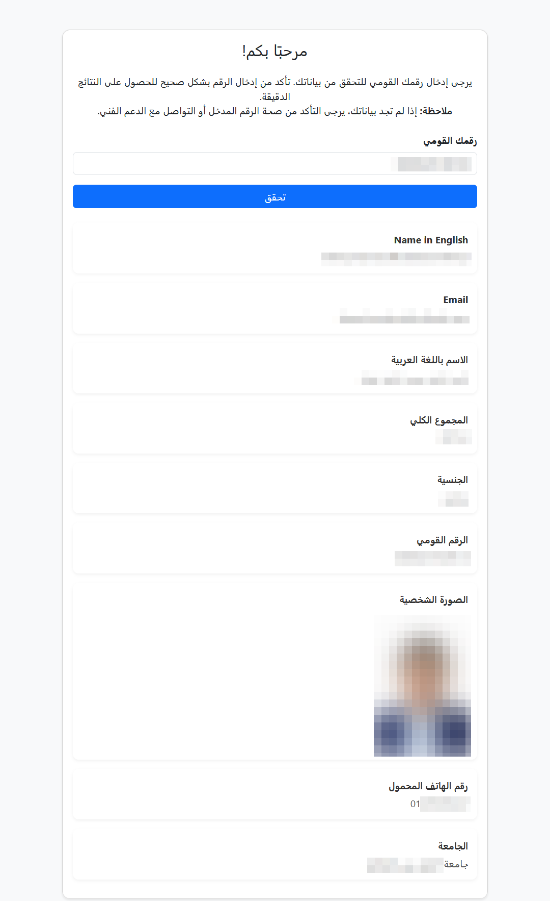

# Google Sheet Query Webapp

A simple Google Apps Script-powered web app that allows users to enter a unique lookup value and retrieve the corresponding row from a Google Sheet. It displays all fields related to that ID, including a rendered image from a Google Drive link if present.

## Features

- Search by a unique lookup value
- Displays all fields from the matched row
- Renders image links from Google Drive (view-only)
- Clean, minimal user interface
- Keeps full spreadsheet data private from the user

---

## Files

- `Code.gs` - Server-side Google Apps Script code
- `Index.html` - Client-side HTML + JavaScript UI

---

## How to Use

### 1. Setup Google Sheet

- Create a Google Sheet with headers in the first row.
- One column should contain the unique lookup field.
- One column may contain Google Drive image links (in the format: `https://drive.google.com/file/d/FILE_ID/view`).

### 2. Open Apps Script

- Go to your Google Sheet.
- Click **Extensions > Apps Script**.
- Replace the default `Code.gs` and `Index.html` with the contents from this repo.
- Follow the comments in both files to customize the app to match your context. For example, write your own welcome message in the UI, specify the lookup field and the fields you want to display, ... etc.

### 3. Deploy the Web App

- In the Apps Script editor:
  - Click **Deploy > Manage deployments**.
  - Select **New deployment**.
  - Choose **Web app**.
  - Set:
    - **Execute as**: Me
    - **Who has access**: Anyone (or "Anyone with link")
  - Click **Deploy** and authorize permissions.

### 4. Use the Web App

- Share the deployment URL.
- Users can enter the lookup value and view the corresponding row.

---

## Image Rendering Note

If a cell contains a Google Drive link like:
```

https://drive.google.com/file/d/FILE_ID/view

```

The app will automatically convert it to:
```

https://drive.google.com/uc?export=view&id=FILE_ID

```

This enables direct image rendering in the web UI.

### Image Must Be Publicly Accessible:

The image itself must be publicly accessible to 'Anyone with the link' in order to be rendered correctly.

---

## Security

- Users can only access rows per lookup.
- No access to entire spreadsheet is given.
- You can restrict access by changing "Who has access" in deployment settings.

---

## Screenshots

### Example Google Spreadsheet:


### Welcome Message in Web App:


### Example Result Display:


---

## License

MIT
